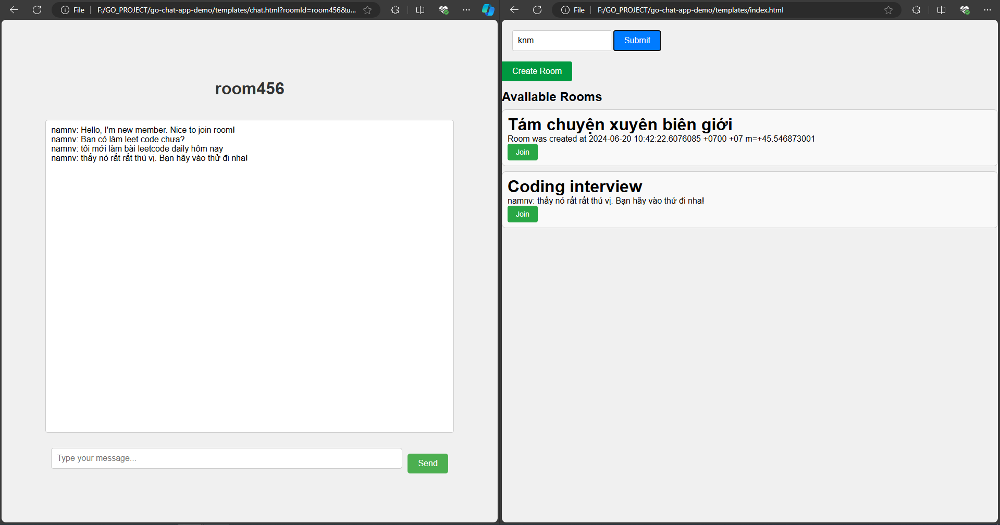
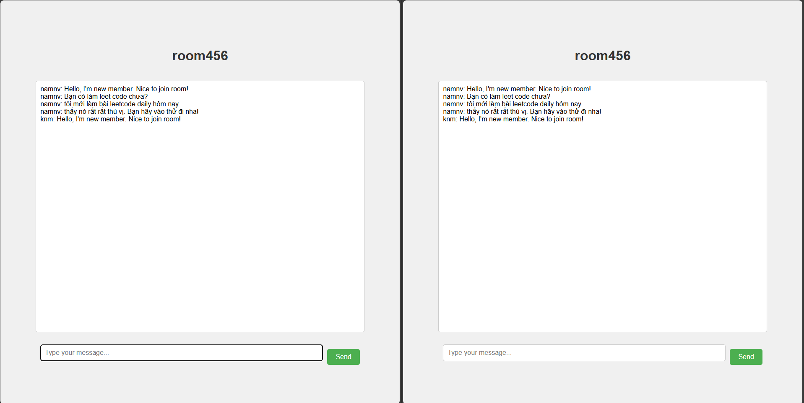
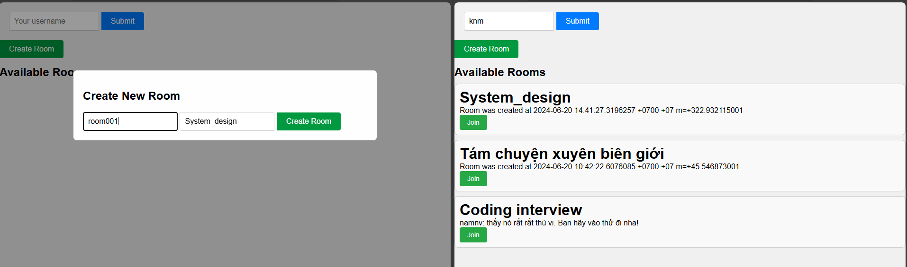
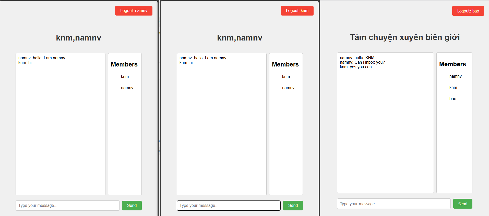
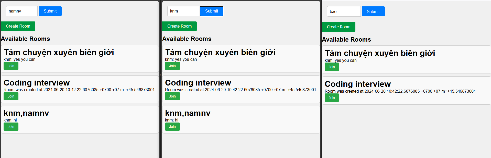

# A basic chat app is implemented by Golang + websocket

# Technologies

    1. websocket - "github.com/gorilla/websocket"
    2. Gin - "github.com/gin-gonic/gin"

# How to start?

    1. run server `main.exe`
    2. run FE `start templates/index.html`

# Flow

The latest message always is updated to show user

Old message also was stored to display new user (maximum config from code is `MaxLengthOldMsg = 50`)

Register new chat room

Inbox

private chat room

