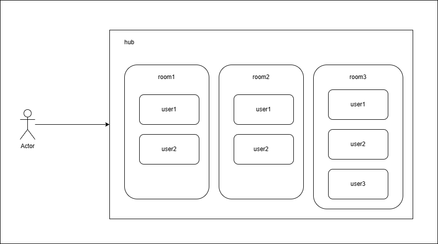

# A basic chat app is implemented by Golang + websocket

# How to start?

    1. run server `go run cmd/main.go`
    2. run FE `start templates/index.html`

# Flow

The latest message always is updated to show user

Old message also was stored to display new user (maximum config from code is `MaxLengthOldMsg = 50`)

Leave message

Register new chat room

Multiple real-time chatting

